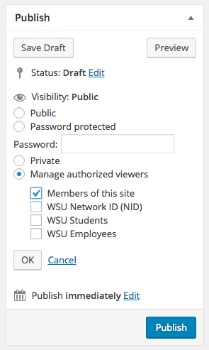

# WSU Content Visibility

[](https://travis-ci.org/washingtonstateuniversity/WSUWP-Content-Visibility)

Control the visibility of content for groups of authenticated users.



## Overview

WSU Content Visibility provides a general method to control visibility of a private post based on the groups a user belongs to. A default `site-member` group is provided. Custom code should be used to provide additional group and user associations through the provided hooks.

## Existing capabilities in WordPress

The following conditions are true by default in WordPress and are not changed by WSUWP Content Visibility:

* All users can view their own private posts.
* Subscribers, Contributors, and Authors can not view private posts owned by others.
* Editors, Administrators, and Super Admins can view all private posts.

If WSUWP Content Visibility is used to assign a group of viewers to a private post that includes existing site Subscribers, Contributors, or Authors, those users will be able to view that private post. Likewise, if used to assign a group that excludes existing Editors, Administrators, and Super Admins, those users will still be able to view that private post.

## Extending WSUWP Content Visibility

### Adding and removing post type support

By default, WSU Content Visibility supports posts and pages. Use `add_post_type_support( 'post-type-slug', 'wsuwp-content-visibility' );` to add support to your custom post types.

Similarly, `remove_post_type_support()` can be used to remove existing support for a feature on a post type. Current support is applied on `init` with a priority of `11`.

### Filtering available groups

A default list of groups is presented once a post's status has been updated to private. The `content_visibility_default_groups` filter should be used to add or remove groups on this list.

Expected return format:

```
array(
    array( 'id' => 'unique-group-id', 'name' => 'A Group Name' ),
    array( 'id' => 'b-unique-group-id', 'name', 'B Group Name' ),
    // etc...
);
}
```

### Filtering user verification

When an authenticated user attempts to view a private post, the `user_in_content_visibility_groups` filter fires to determine if the user is a member of an assigned group.

The user and a list of group IDs assigned as viewers to the post will be passed to the filter to help in determining view access.
